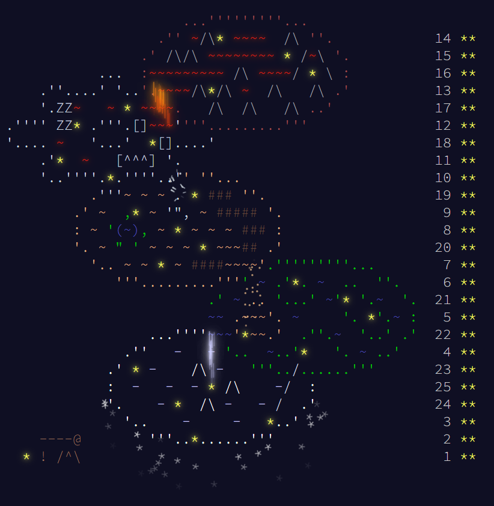

# AdventOfCode2023.jl

My solutions for [Advent of Code 2023](https://adventofcode.com/2023/) using the [julia programming language](https://julialang.org/).
Project structure was taken from [goggle/AdventOfCode2021.jl](https://github.com/goggle/AdventOfCode2021.jl) with some modifications.



## Benchmarks
| Day | Problem | Time | Allocated memory | Solution |
|----:|:-------:|-----:|-----------------:|:-----------:|
| 1 | [:white_check_mark:](https://adventofcode.com/2023/day/1) | 3.422 ms | 129.83 KiB | [:white_check_mark:](https://github.com/electronsandstuff/AdventofCode2023/blob/main/src/day01.jl) |      
| 2 | [:white_check_mark:](https://adventofcode.com/2023/day/2) | 1.388 ms | 1.67 MiB | [:white_check_mark:](https://github.com/electronsandstuff/AdventofCode2023/blob/main/src/day02.jl) |        
| 3 | [:white_check_mark:](https://adventofcode.com/2023/day/3) | 3.114 ms | 10.70 MiB | [:white_check_mark:](https://github.com/electronsandstuff/AdventofCode2023/blob/main/src/day03.jl) |       
| 4 | [:white_check_mark:](https://adventofcode.com/2023/day/4) | 957.500 μs | 629.66 KiB | [:white_check_mark:](https://github.com/electronsandstuff/AdventofCode2023/blob/main/src/day04.jl) |    
| 5 | [:white_check_mark:](https://adventofcode.com/2023/day/5) | 843.400 μs | 2.40 MiB | [:white_check_mark:](https://github.com/electronsandstuff/AdventofCode2023/blob/main/src/day05.jl) |      
| 6 | [:white_check_mark:](https://adventofcode.com/2023/day/6) | 3.025 μs | 2.40 KiB | [:white_check_mark:](https://github.com/electronsandstuff/AdventofCode2023/blob/main/src/day06.jl) |        
| 7 | [:white_check_mark:](https://adventofcode.com/2023/day/7) | 21.077 ms | 21.68 MiB | [:white_check_mark:](https://github.com/electronsandstuff/AdventofCode2023/blob/main/src/day07.jl) |      
| 8 | [:white_check_mark:](https://adventofcode.com/2023/day/8) | 13.968 ms | 676.75 KiB | [:white_check_mark:](https://github.com/electronsandstuff/AdventofCode2023/blob/main/src/day08.jl) |     
| 9 | [:white_check_mark:](https://adventofcode.com/2023/day/9) | 718.900 μs | 886.25 KiB | [:white_check_mark:](https://github.com/electronsandstuff/AdventofCode2023/blob/main/src/day09.jl) |    
| 10 | [:white_check_mark:](https://adventofcode.com/2023/day/10) | 12.625 ms | 14.05 MiB | [:white_check_mark:](https://github.com/electronsandstuff/AdventofCode2023/blob/main/src/day10.jl) |    
| 11 | [:white_check_mark:](https://adventofcode.com/2023/day/11) | 1.785 ms | 508.19 KiB | [:white_check_mark:](https://github.com/electronsandstuff/AdventofCode2023/blob/main/src/day11.jl) |    
| 12 | [:white_check_mark:](https://adventofcode.com/2023/day/12) | 89.303 ms | 114.29 MiB | [:white_check_mark:](https://github.com/electronsandstuff/AdventofCode2023/blob/main/src/day12.jl) |   
| 13 | [:white_check_mark:](https://adventofcode.com/2023/day/13) | 739.100 μs | 851.51 KiB | [:white_check_mark:](https://github.com/electronsandstuff/AdventofCode2023/blob/main/src/day13.jl) |  
| 14 | [:white_check_mark:](https://adventofcode.com/2023/day/14) | 197.782 ms | 448.60 MiB | [:white_check_mark:](https://github.com/electronsandstuff/AdventofCode2023/blob/main/src/day14.jl) |  
| 15 | [:white_check_mark:](https://adventofcode.com/2023/day/15) | 2.370 ms | 1.97 MiB | [:white_check_mark:](https://github.com/electronsandstuff/AdventofCode2023/blob/main/src/day15.jl) |      
| 16 | [:white_check_mark:](https://adventofcode.com/2023/day/16) | 29.187 ms | 27.13 MiB | [:white_check_mark:](https://github.com/electronsandstuff/AdventofCode2023/blob/main/src/day16.jl) |    
| 17 | [:white_check_mark:](https://adventofcode.com/2023/day/17) | 1.293 s | 1.06 GiB | [:white_check_mark:](https://github.com/electronsandstuff/AdventofCode2023/blob/main/src/day17.jl) |       
| 18 | [:white_check_mark:](https://adventofcode.com/2023/day/18) | 662.900 μs | 681.52 KiB | [:white_check_mark:](https://github.com/electronsandstuff/AdventofCode2023/blob/main/src/day18.jl) |  
| 19 | [:white_check_mark:](https://adventofcode.com/2023/day/19) | 1.286 ms | 2.09 MiB | [:white_check_mark:](https://github.com/electronsandstuff/AdventofCode2023/blob/main/src/day19.jl) |      
| 20 | [:white_check_mark:](https://adventofcode.com/2023/day/20) | 51.433 ms | 97.94 MiB | [:white_check_mark:](https://github.com/electronsandstuff/AdventofCode2023/blob/main/src/day20.jl) |    
| 21 | [:white_check_mark:](https://adventofcode.com/2023/day/21) | 33.622 ms | 21.62 MiB | [:white_check_mark:](https://github.com/electronsandstuff/AdventofCode2023/blob/main/src/day21.jl) |    
| 22 | [:white_check_mark:](https://adventofcode.com/2023/day/22) | 91.303 ms | 75.86 MiB | [:white_check_mark:](https://github.com/electronsandstuff/AdventofCode2023/blob/main/src/day22.jl) |    
| 23 | [:white_check_mark:](https://adventofcode.com/2023/day/23) | 22.882 s | 21.78 GiB | [:white_check_mark:](https://github.com/electronsandstuff/AdventofCode2023/blob/main/src/day23.jl) |     
| 24 | [:white_check_mark:](https://adventofcode.com/2023/day/24) | 476.600 μs | 316.73 KiB | [:white_check_mark:](https://github.com/electronsandstuff/AdventofCode2023/blob/main/src/day24.jl) |  
| 25 | [:white_check_mark:](https://adventofcode.com/2023/day/25) | 494.368 ms | 254.43 MiB | [:white_check_mark:](https://github.com/electronsandstuff/AdventofCode2023/blob/main/src/day25.jl) |  

This data was taken on the following machine.
```
OS: Windows 10 (x86_64)
CPU: AMD Ryzen 9 7950x @ 4.5GHz
WORD_SIZE: 64
```
